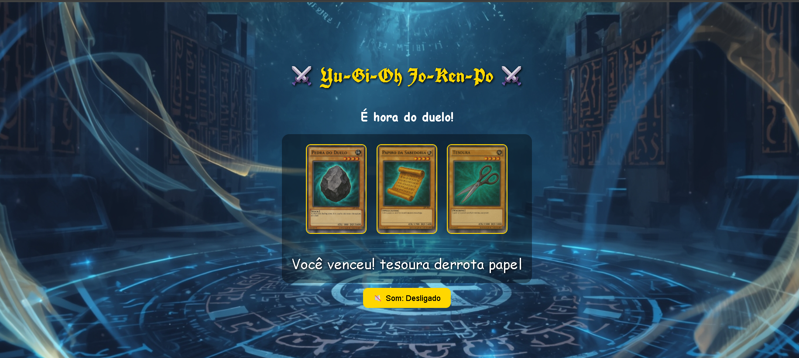

# ⚔️ Yu-Gi-Oh Jo-Ken-Po ⚔️

## Descrição

Yu-Gi-Oh Jo-Ken-Po é um jogo de cartas inspirado no clássico “Pedra, Papel e Tesoura” com temática de Yu-Gi-Oh.  
O jogador escolhe uma carta e enfrenta o computador em duelos rápidos.  
O jogo inclui **efeitos sonoros**, música de fundo em loop e a opção de ligar/desligar o som.

---

## Funcionalidades

- Escolha entre Pedra, Papel ou Tesoura.  
- Resultado instantâneo: vitória, derrota ou empate.  
- Música de fundo em loop.  
- Botão para ligar/desligar todos os sons do jogo.  
- Responsivo para telas pequenas (mobile).

---

## Como Jogar

1. Abra o arquivo `index.html` em um navegador.  
2. Clique na carta desejada para jogar.  
3. Veja o resultado na tela.  
4. Use o botão **🔊 Som** para ativar/desativar música e efeitos.

---

## Tecnologias Utilizadas

- HTML5  
- CSS3  
- JavaScript  
- Google Fonts: [UnifrakturCook](https://fonts.google.com/specimen/UnifrakturCook), [Cinzel Decorative](https://fonts.google.com/specimen/Cinzel+Decorative)

---

## Como Contribuir

1. Faça um fork deste repositório.  
2. Crie uma branch com sua feature: `git checkout -b minha-feature`.  
3. Faça commit das alterações: `git commit -m 'Minha feature'`.  
4. Envie para o branch remoto: `git push origin minha-feature`.  
5. Abra um Pull Request.  

---

## Demonstração
jogar 
[Demo do Jogo]()

## Autor

**Tatiane Lima** – [LinkedIn](https://www.linkedin.com/in/tati-lima85)

---

